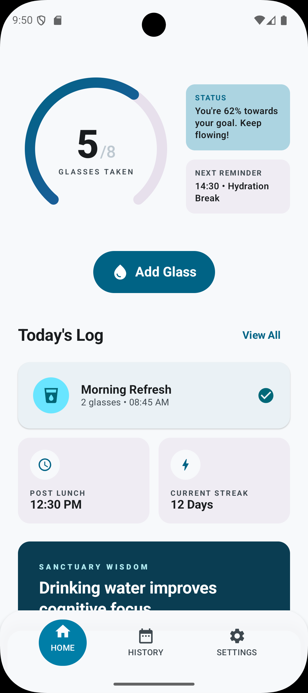
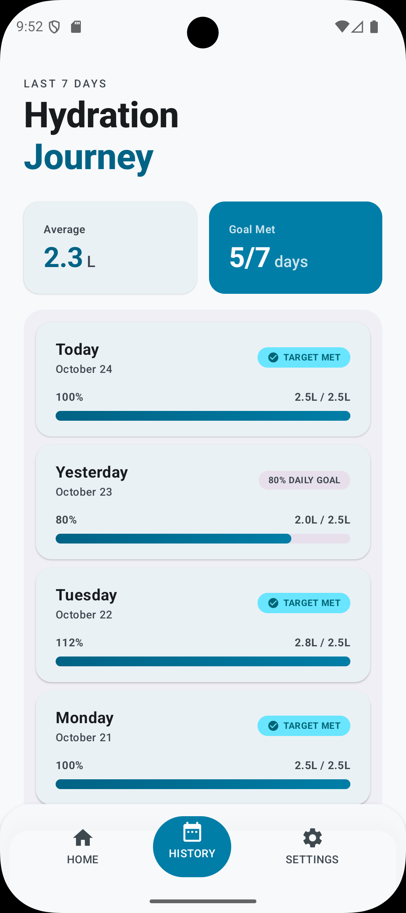
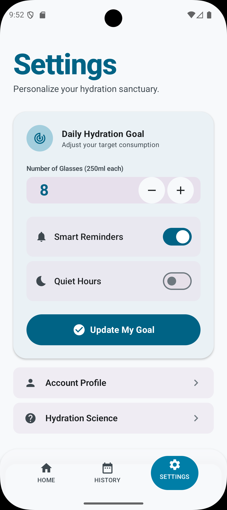

# 💧 Fluid Sanctuary

A hydration tracking app built as a portfolio project to demonstrate an end-to-end design-to-development pipeline using Google Stitch, Figma, Android Studio, and GitHub.

---

## 📱 Screens

| Home | History | Settings |
|------|---------|----------|
|  |  |  |

---

## 🔧 Pipeline

This project was built following a deliberate design-to-code workflow:

```
Google Stitch  →  Figma  →  Android Studio  →  GitHub
```

**Google Stitch**
Used to generate the initial UI concepts from natural language prompts. Stitch produced three screens with a consistent visual language and exported a `DESIGN.md` file with the full design system specification — colors, typography, elevation rules, and component guidelines.

**Figma**
Received the Stitch export via "Copy to Figma". Used to refine components, define reusable styles, and build the navigable prototype that validated the user flow before writing production code.

**Android Studio**
Implemented the UI in Jetpack Compose following the design system extracted from Stitch. Colors were mapped directly from the exported Tailwind config to `Color.kt`. Typography was mapped to `Type.kt` using the Plus Jakarta Sans font family specified in `DESIGN.md`.

**GitHub**
Each screen was developed in its own feature branch and merged to `main` via pull request. This keeps the commit history readable and mirrors a professional team workflow.

---

## 🏗️ Architecture

```
UI Layer
├── screens/
│   ├── HomeScreen.kt
│   ├── HistoryScreen.kt
│   └── SettingsScreen.kt
├── components/
│   └── BottomNavBar.kt
└── theme/
    ├── Color.kt
    └── Type.kt
    └── Theme.kt

Navigation
└── FluidSanctuaryApp.kt   ← NavHost + Scaffold

Data Layer (in progress)
├── db/
│   ├── AppDatabase.kt
│   ├── WaterEntry.kt
│   └── WaterDao.kt
└── repository/
    └── WaterRepository.kt
```

The architecture follows the separation of concerns principle recommended by the Android team: the UI layer knows nothing about data sources, and the data layer knows nothing about the UI.

---

## 🌿 Branch strategy

```
main
├── feature/home-screen
├── feature/history-screen
└── feature/room-viewmodel    ← in progress
```

Each feature branch maps to a single screen or capability. Merges to `main` only happen when the feature compiles and runs without errors on the emulator.

---

## 🚀 Running the project locally

**Requirements**
- Android Studio Hedgehog or later
- JDK 17
- Android emulator with API 26 or physical device running Android 8.0+

**Steps**

```bash
# 1. Clone the repository
git clone https://github.com/roroar9612/FluidSanctuary.git

# 2. Open in Android Studio
# File → Open → select the FluidSanctuary folder

# 3. Sync Gradle
# Click "Sync Now" when Android Studio prompts

# 4. Run
# Select your emulator or device and press Run (Shift+F10)
```

No API keys or environment variables are required. The app runs entirely offline with local data.

---

## 🎨 Design system

The visual language is defined by the *Fluid Sanctuary* creative brief exported from Stitch:

| Token | Value |
|-------|-------|
| Primary | `#006385` |
| Primary Container | `#007EA7` |
| Background | `#F7F9FB` |
| Surface | `#F7F9FB` |
| On Surface | `#191C1E` |
| Font | Plus Jakarta Sans |
| Corner radius (default) | 16dp |
| Corner radius (pill) | 9999dp |

The system follows Material You (Material Design 3) with a custom color scheme derived from the "wet and refreshing" palette concept in `DESIGN.md`.

---

## 📦 Tech stack

| Layer | Technology |
|-------|-----------|
| UI | Jetpack Compose |
| Navigation | Navigation Compose 2.7.7 |
| Theme | Material Design 3 |
| Language | Kotlin |
| Build | Gradle with Kotlin DSL |
| Version control | Git + GitHub |

---

## 🗺️ Roadmap

- [x] Base architecture and navigation
- [x] HomeScreen with circular progress indicator
- [x] HistoryScreen with 7-day log
- [x] SettingsScreen with goal configuration
- [ ] Room database + ViewModel
- [ ] WorkManager notifications
- [ ] Home screen widget with Glance
- [ ] Unit tests for ViewModel logic
